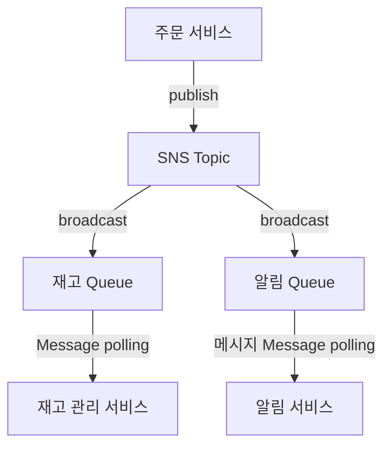

### EDA 주요 목적
- 구성 요소 간 결합도를 낮춤.
- 확장성과 유연성을 향상.
- 비동기 처리를 활용하여 시스템 성능 최적화.

### **EDA의 주요 구성 요소**
1. **Event**: 시스템 내에서 발생하는 중요한 상태 변화. 예: 주문 생성, 결제 완료.
2. **Event Producer**: 이벤트를 생성하는 구성 요소.
3. **Event Broker**: 이벤트를 관리하고 적절한 consumer에게 전달하는 중재자.
4. **Event Consumer**: 이벤트를 수신하고 처리하는 구성 요소.

---

## AWS 기반 EDA

AWS는 **SNS(Simple Notification Service)**와 **SQS(Simple Queue Service)**와 같은 서비스를 제공하여 EDA를 구현할 수 있도록 지원합니다.

### **1. AWS SNS (Simple Notification Service)**
- **퍼블리시/구독 (Publish/Subscribe)** 모델을 기반으로 하는 서비스로, 한 producer가 다수의 consumer에게 이벤트를 broadcast합니다.
- **특징**:
   - HTTP(S), 이메일, Lambda, SQS 등 다양한 전달 방식 지원.
   - 실시간 알림을 위한 푸시 기반 전달.
- **사용 사례**:
   - 여러 마이크로서비스로 이벤트를 브로드캐스트.
   - 실시간 알림 전송.

### **2. AWS SQS (Simple Queue Service)**
- **비동기 처리**를 위한 메시지 대기열 서비스.
- **특징**:
   - **Standard Queue**: 높은 처리량, 중복 허용, 메시지 순서 비보장.
   - **FIFO Queue**: 메시지 순서 보장, 중복 제거.
   - 메시지 보관 및 폴링(polling) 지원.
- **사용 사례**:
   - 비동기 작업 처리.
   - 작업량 제한 및 처리 안정성 확보.

---

## SNS와 SQS의 조합
SNS와 SQS를 조합하면 확장성과 신뢰성을 모두 갖춘 EDA를 구현할 수 있습니다.

### **아키텍처와 동작**
1. **이벤트 producer**가 SNS topic에 이벤트를 게시.
2. SNS는 이벤트를 여러 SQS Queue로 브로드캐스트.
3. **이벤트 consumer**는 각자의 SQS Queue에서 이벤트를 비동기적으로 처리.

### **장점**
- **확장성**: SNS는 여러 SQS Queue로 이벤트를 브로드캐스트하여 consumer들이 독립적으로 작동 가능.
- **비동기 처리**: SQS는 consumer가 오프라인 상태에서도 이벤트 손실을 방지.
- **신뢰성**: SQS는 재시도, DLQ(Dead Letter Queue)를 통해 메시지의 최소 1회 전달 보장.

---

## Example
1. 고객이 주문을 생성하면 **주문 서비스**가 "주문 생성" 이벤트를 SNS Topic로 게시.
2. SNS는 이벤트를 다음 두 개의 Queue로 broadcast:
   - **재고 Queue**: 재고 관리 서비스에서 처리.
   - **알림 Queue**: 이메일/SMS 알림 서비스에서 처리.
3. consumer들은 각각의 SQS Queue에서 메시지를 폴링하여 비동기적으로 작업 수행.

---

## 구현 시 고려 사항
1. **중복 방지**: FIFO Queue를 사용하여 메시지 중복을 방지.
2. **에러 처리**: 처리 불가 메시지를 DLQ로 전송하여 재처리 로직 구현.
3. **보안**: IAM 정책을 사용하여 SNS 및 SQS 접근 제어.
4. **성능 최적화**: SQS 배치 처리 기능을 사용하여 처리량 향상.

---

## AWS 기반 EDA의 장점
- **낮은 결합도**: producer와 consumer를 분리하여 시스템 모듈화를 개선.
- **유연성**: 새로운 consumer를 기존 SNS Topic에 쉽게 구독 가능.
- **내결함성**: SQS는 consumer가 임시로 오프라인 상태인 경우에도 메시지 손실을 방지.
